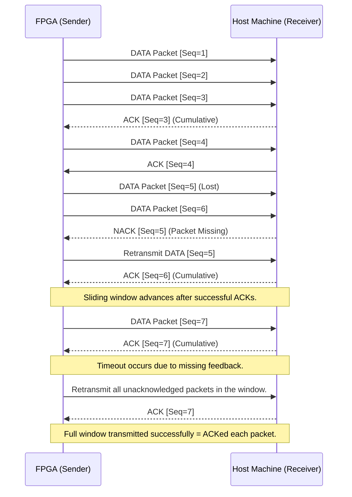
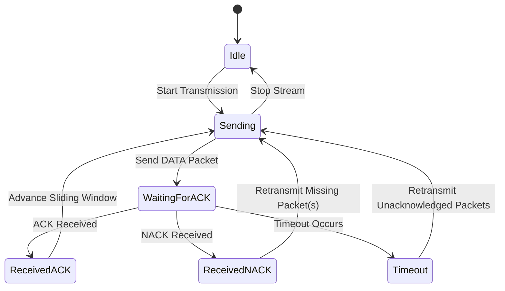
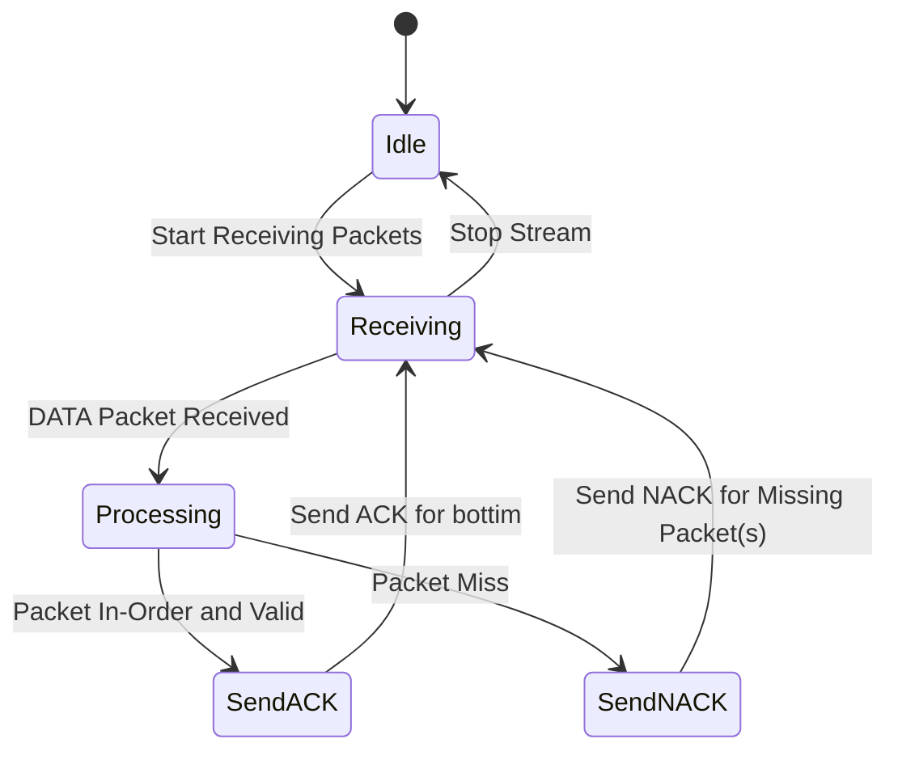

# ICD for RFSoC I-Q High-Speed Streaming Protocol

## Example Sequence Diagram

## Sender State Diagram

## Receiver State Diagram

## Interface Control Document (ICD) for LAN Streaming Protocol

## 1.0 Scope

This document defines the interface between an FPGA capable of transmitting UDP packets and a host machine with an SFP28 interface. The protocol ensures reliable data transmission using a sliding window mechanism with acknowledgments (ACKs) and negative acknowledgments (NACKs). It specifies the message structure, data flow, and error recovery mechanisms.

## 2.0 System Description

## 2.1 FPGA System Overview

-   **Role**: Sender
-   **Functionality**: Transmits data packets over UDP using a sliding window protocol.
-   **Interface**: SFP28 connection to the host.
-   **Capabilities**:

    -   Assigns sequence numbers to packets.
    -   Maintains a buffer for retransmission.
    -   Sends ACKs and NACKs based on received feedback.

## 2.2 Host Machine Overview

-   **Role**: Receiver
-   **Functionality**: Receives packets, processes them in order, and provides feedback (ACK/NACK).
-   **Interface**: SFP28 connection to the FPGA.
-   **Capabilities**:

    -   Maintains a receive buffer.
    -   Detects missing or out-of-order packets.
    -   Sends ACKs for successfully received packets and NACKs for missing ones.

## 3.0 Detailed Interface Requirements

## 3.1 Data Protocol

-   **Protocol**: UDP with sliding window reliability enhancement.
-   **Packet Structure**:

    -   **Header Fields**:

        -   Sequence Number (32 bits): Unique identifier for each packet.
        -   Window Size (16 bits): Indicates the current sliding window size.
        -   Control Flags (8 bits): Identifies packet type (DATA, ACK, NACK).
        -   Checksum (16 bits): Ensures data integrity.

    -   **Payload**:

        -   Variable-length data up to the maximum transmission unit (MTU).

## 3.2 Sliding Window Mechanism

-   **Window Size**: Configurable, default is 64 packets.
-   **Operation**:

    -   Sender transmits packets within the current window range without waiting for individual ACKs.
    -   Receiver acknowledges the highest consecutive sequence number received correctly using cumulative ACKs.
    -   Gaps in sequence numbers trigger NACKs for specific missing packets.

## 3.3 Error Recovery

-   **Retransmissions**:

    -   Upon receiving a NACK, the sender retransmits the specified missing packet(s).
    -   Retransmissions are attempted until an ACK is received or a timeout occurs.

-   **Timeout Mechanism**:

    -   If no feedback (ACK/NACK) is received within a predefined timeout period, the sender retransmits all unacknowledged packets in the current window. It will attempt this three times, before abandoning the connection.

## 3.4 Communication Flow

1. Receiver sends a Start Stream Command, with a Sliding Window Range.
2. Sender initializes transmission by sending packets within the sliding window range.
3.  Receiver processes incoming packets:

    - When the Sender receives a packet, it adds to its sliding buffer
    - If the received packet is at the bottom of the sliding window and there are no empty packets between bottom and top, then Receiver sends and ACK for top of window.
    - Otherwise, sends a NACK for any missing packets.
4.  Sender adjusts its window based on feedback:
    -   Advances the window upon receiving ACKs.
    -   Resends missing packets based on NACKs.

## 4.0 Physical Requirements

-   **Interface Type**: SFP28 transceiver supporting Ethernet at up to 25 Gbps.
-   **Cable Type**: Direct Attach Copper (DAC) or optical fiber as per system requirements.

## 5.0 Data Integrity

-   **Data Integrity**: Ensured through checksums in each packet header.

## 6.0 Testing and Validation

-   Simulate high packet loss scenarios to test retransmission mechanisms.
-   Validate proper operation of sliding window adjustments under varying network conditions.

## Appendix A: Glossary

-   **SFP28**: Small Form-factor Pluggable module supporting up to 25 Gbps Ethernet connections.
-   **UDP**: User Datagram Protocol, a connectionless transport protocol.